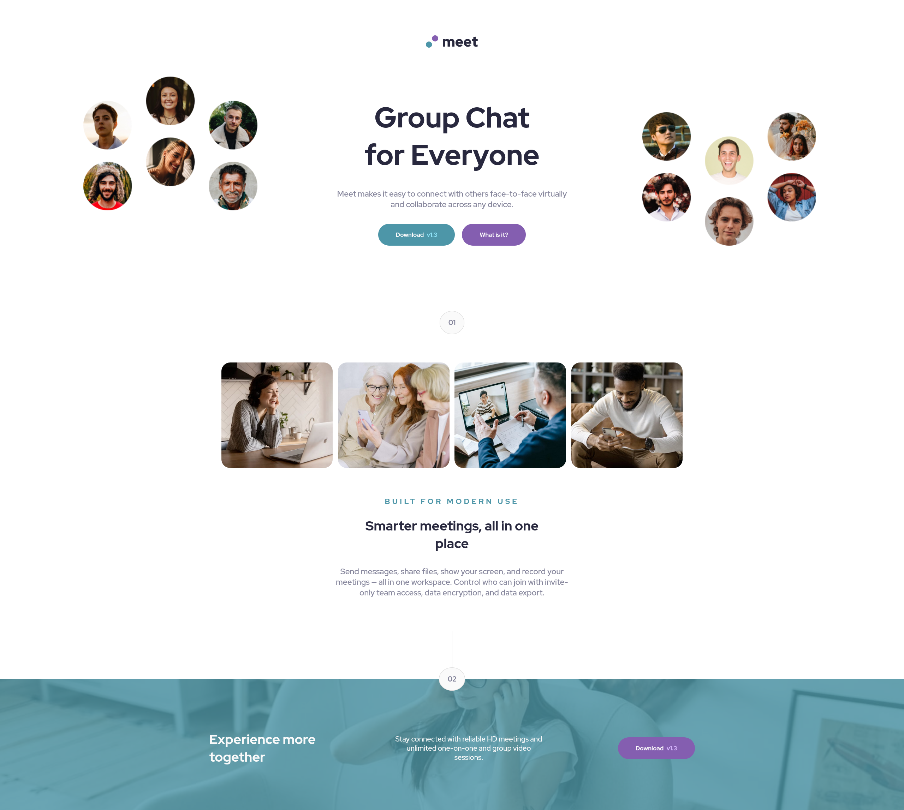
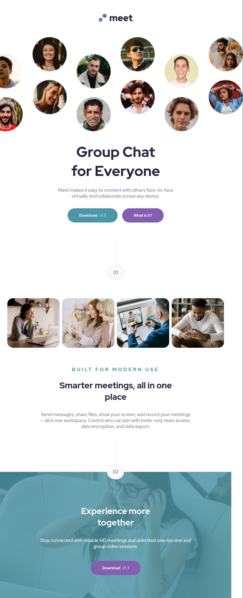

# Frontend Mentor - Meet landing page solution

This is a solution to the [Meet landing page challenge on Frontend Mentor](https://www.frontendmentor.io/challenges/meet-landing-page-rbTDS6OUR). Frontend Mentor challenges help you improve your coding skills by building realistic projects. 

## Table of contents

- [Overview](#overview)
  - [The challenge](#the-challenge)
  - [Screenshot](#screenshot)
  - [Links](#links)
- [My process](#my-process)
  - [Built with](#built-with)
  - [What I learned](#what-i-learned)
  - [Continued development](#continued-development)
  - [Useful resources](#useful-resources)
- [Author](#author)
- [Acknowledgments](#acknowledgments)

## Overview

### The challenge

Users should be able to:

- View the optimal layout depending on their device's screen size
- See hover states for interactive elements

### Screenshot

### Links
-[Solution URL](https://github.com/PRINCEKK122)

-[Live site](https://meet-fem.netlify.app/)

## My process

### Built with

- Semantic HTML5 markup
- CSS Box Model
- Flexbox
- SASS
- Mobile-first workflow

### What I learned
I challenged myself to use SASS for this project. The resource that I used to help me get the job done was Brad Travery's [HTML and CSS From the Beginning](https://www.udemy.com/course/modern-html-css-from-the-beginning/). I am not affiliated to this course in anyways, but I believe it is one of the best resources out there to get you up to speed.

### Continued development
Henceforth, I will be using SASS to complete most of the front-end mentor challenges, together with the React Framework.

### Useful resources
[HTML and CSS From the Beginning](https://www.udemy.com/course/modern-html-css-from-the-beginning/)

## Author

- Website - [PRINCEKK122](https://github.com/PRINCEKK122)
- Frontend Mentor - [@PRINCEKK122](https://www.frontendmentor.io/profile/yourusername)

## Acknowledgments
@xtirian challenged me to complete this project, and I am looking forward to complete more chanllenges with him.
